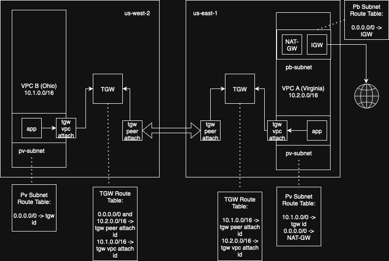

# Transit-Gateway Lab

## Description

This Lab was designed to test a transit-gateway connection between 2 diferent regions that provides an exit to the internet through a NAT-GW implemented in one of them. The simplified topology can be found in the diagram below:

## Prerequisites

To implement this lab, it is necessary to have:

- AWS account configured locally with respective credentials
- Terragrunt

## Implementation

To create Terraform resources and organize them with Terragrunt it was necessary implement them using Terraform Modules. The used modules are available in other Github repositories. The only inconvenience found was: to create Transit Gateway routes with the applied module, as the variable does not accept an input of list(strng) type, led to a workaround: one directory per TGW route. Considering that this repository is a small lab, it's not a huge issue, but it must be considered to greater environments.

The challenge of this implementation came from this [Medium article](https://medium.com/@marcchristianp.gregorio/automating-centralized-nat-gateways-in-aws-vpcs-and-region-with-terraform-69a6f90d60da) as a cost-saving solution with a centralized management of the NAT-Gateway. 

From deployed instance in us-east-1 it was possible to ping the instance located in us-west-2, which means that the Transit-Gateway works well.
